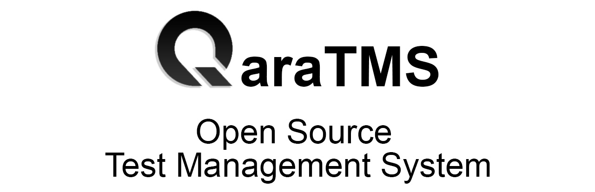
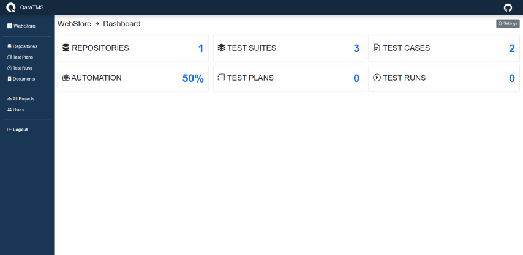
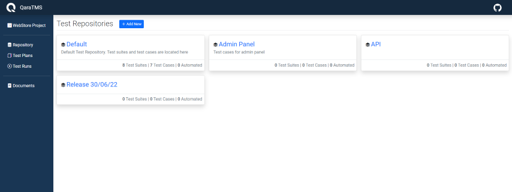
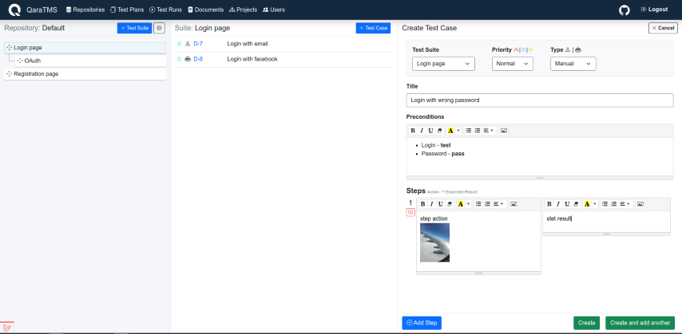
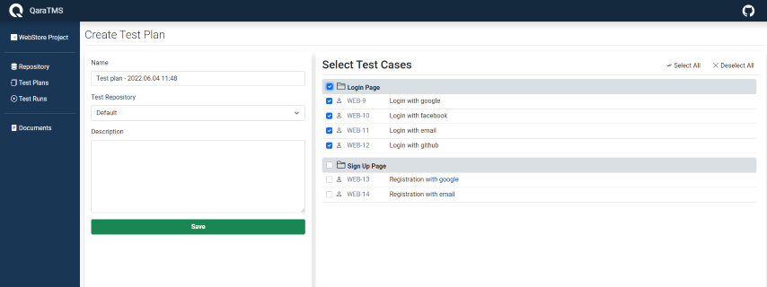
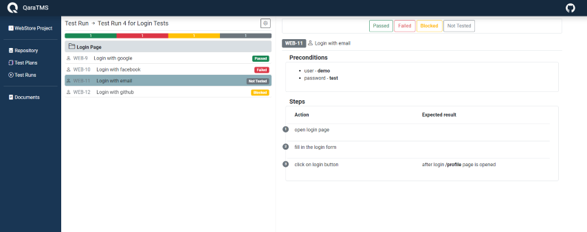
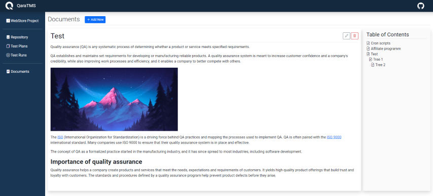

# QaraTMS - Open Source Test Management System

**QaraTMS** is an open source test management software for managing test suites, test cases, test plans, test runs and
documentation.

## Languages and Tools:

<a href="https://php.net/" title="PHP"></a>
<a href="https://laravel.com/" title="Laravel"></a>
<a href="https://www.w3.org/TR/html5/" title="HTML5"></a>
<a href="https://www.w3.org/TR/CSS/" title="CSS3"></a>
<a href="https://jquery.com/" title="jQuery"></a>
<a href="https://developer.mozilla.org/en-US/docs/Web/JavaScript" title="JavaScript"></a>

## Getting Started

- You need to have **php ^8.1**, **mysql-8** or **SQLite**, **composer** installed.
- Pull the project from GitHub.
- Create a database named `tms` using `utf8_general_ci`, or you can use SQLite.
- Run `composer install` or `php composer.phar install`
- Copy and rename the `.env.backup` file to `.env` and fill the database information.
- Run `php artisan key:generate`
- Run `php artisan migrate`
- Run `php artisan db:seed --class=AdminSeeder` to create admin user and assign permissions.
- Run `php artisan serve`
- You can now access QaraTMS at **http://localhost**
- Login with default email and password - **admin@admin.com** / **password**
- Go to **Users** page and change default email and password.

If you are using SQLite:

* Create **database.sqlite** file in **./database** folder
* Copy and rename the `.env_sqlite.backup` file to `.env` and fill the database information.

### Generating Helper Sources for Project

This project is configured to use the laravel-ide-helper. To generate the helper files run these commands:

Windows:

```bash
php artisan ide-helper:generate; php artisan ide-helper:models --write-mixin; php artisan ide-helper:meta; php artisan ide-helper:eloquent
```

## Getting Started with docker-compose (quick start)

- Install docker and docker-compose
- Make docker-run.sh file executable `sudo chmod +x docker-run.sh` and run `./docker-run.sh `
- Or `docker compose up -d --build` and on the first run or after clearing the database or its
  volume `docker exec app php artisan migrate` and `docker exec app php artisan db:seed --class=AdminSeeder` to
  create the admin user and assign permissions

## Getting Started with docker-compose (extended)

- To access advanced configuration, refer to the [extended documentation](DOCKER_README.md)

## How to use it



1. Create a Project.<br>
   [](public/img/5.png)
   <br><br>
2. Create a Test Repository. Test suites and test cases are located inside test repositories.
   You can create several test repositories for different project modules e.g. web, admin, API, etc.<br>
   [](public/img/1.png)
   <br><br>
3. Add test suites and test cases to the test repository.<br>
   [](public/img/2.png)
   <br><br>
4. Create a test plan and select the test cases you need to test.<br>
   [](public/img/3.png)
   <br><br>
5. Start new test run.<br>
   [](public/img/4.png)
   <br><br>
6. Also, there is documentation module where you can store your project's documentation.<br>
   [](public/img/6.png)
   <br><br>

## Contributing

Please contribute using [GitHub Flow](https://guides.github.com/introduction/flow). Create a branch, add commits,
and [open a pull request](https://github.com/a13xh7/QaraTMS/compare).

### Updating Models

When a model is updated, the helper files for it must be regenerated to provide autocompletion inside the source code.
To do so, run this command:

```bash
php artisan ide-helper:models -M
```

### Running Tests

Before running tests locally you need to initialize the testing environment database using

```bash
php artisan migrate --env=testing
```

after that is done, you can run the tests using

```bash
php artisan test
```

> The `testing` environment is automatically applied when running `php artisan test` so the tests use the .env.testing
> file as the configuration.

#### Code Coverage

To evaluate the code coverage, xdebug must be installed and its mode must contain `coverage`. After that, you can
execute the tests with code coverage analysis enabled using

```bash
php artisan test --coverage
```

## License

QaraTMS is licensed under the [MIT](https://choosealicense.com/licenses/mit/) license.
