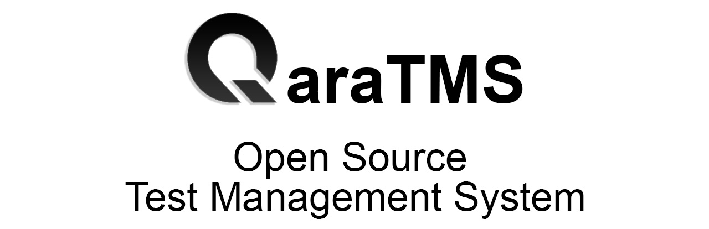
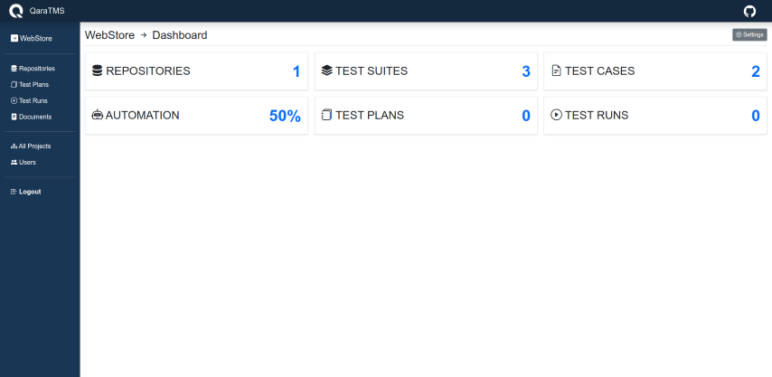
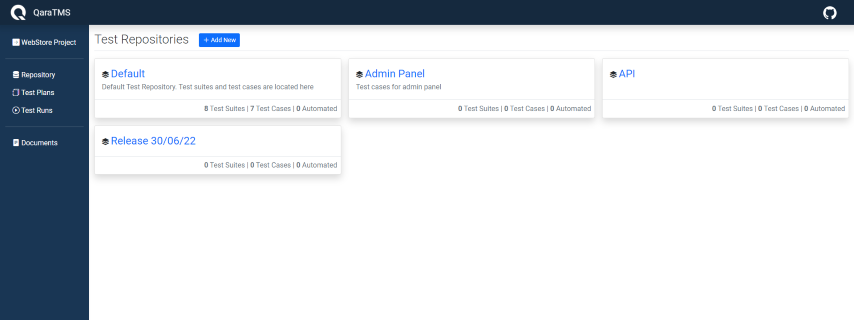
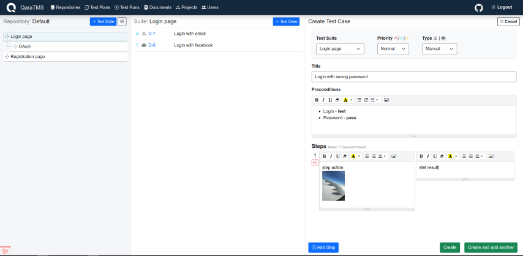
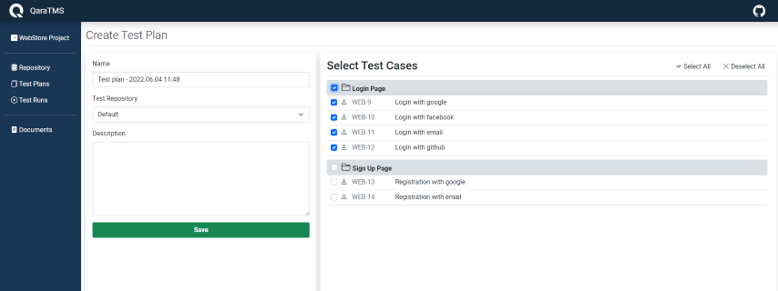
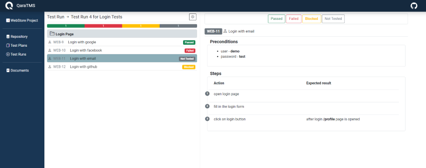
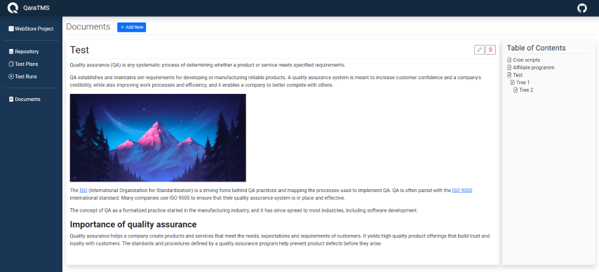

# QaraTMS - Sistema de Gestión de Pruebas de Código Abierto

**QaraTMS** (también conocido como **TestFlow**) es un software de gestión de pruebas de código abierto moderno para administrar suites de pruebas, casos de prueba, planes de pruebas, ejecuciones de pruebas y documentación del proyecto.

## 🚀 Características Principales

- ✨ **Interfaz Moderna**: Diseño inspirado en el template premium Sash con tema claro/oscuro
- 🌐 **Multiidioma**: Soporte completo para Español e Inglés con cambio dinámico
- 🎨 **Sistema de Temas**: Cambio automático entre tema claro, oscuro y automático (según preferencias del sistema)
- 📱 **Responsive**: Completamente adaptativo para dispositivos móviles, tablets y escritorio
- 🔒 **Gestión de Usuarios**: Sistema completo de autenticación y permisos
- 📊 **Dashboard Avanzado**: Visualización de métricas y estadísticas de pruebas
- 🔄 **Persistencia de Preferencias**: Las configuraciones del usuario se mantienen entre sesiones
- ⚡ **Rendimiento Optimizado**: Interfaz rápida sin parpadeos ni cargas innecesarias

## 🛠️ Tecnologías y Herramientas

<a href="https://php.net/" title="PHP"></a>
<a href="https://laravel.com/" title="Laravel"></a>
<a href="https://getbootstrap.com/" title="Bootstrap"></a>
<a href="https://www.w3.org/TR/html5/" title="HTML5"></a>
<a href="https://www.w3.org/TR/CSS/" title="CSS3"></a>
<a href="https://developer.mozilla.org/en-US/docs/Web/JavaScript" title="JavaScript"></a>

### Stack Tecnológico
- **Backend**: PHP 8.1+, Laravel Framework
- **Frontend**: HTML5, CSS3, JavaScript ES6+, Bootstrap 5.3.3
- **Base de Datos**: MySQL 8+ o SQLite
- **Iconos**: Bootstrap Icons para una interfaz moderna y coherente
- **Diseño**: Inspirado en template premium Sash con personalización completa

## 📋 Requisitos Previos

- **PHP** ^8.1
- **MySQL** 8+ o **SQLite**
- **Composer**
- **Servidor Web** (Apache/Nginx) o usar el servidor integrado de Laravel

## 🚀 Instalación Rápida

### Método Tradicional

1. **Clonar el repositorio**
   ```bash
   git clone https://github.com/javiandgo/QaraTMS.git
   cd QaraTMS
   ```

2. **Instalar dependencias**
   ```bash
   composer install
   ```

3. **Configurar base de datos**
   - Crear base de datos `tms` con codificación `utf8_general_ci`
   - O usar SQLite creando `database.sqlite` en la carpeta `./database`

4. **Configuración del entorno**
   ```bash
   # Para MySQL
   cp .env.backup .env
   
   # Para SQLite
   cp .env_sqlite.backup .env
   ```
   
   Editar `.env` con tu configuración de base de datos

5. **Configuración inicial**
   ```bash
   php artisan key:generate
   php artisan migrate
   php artisan db:seed --class=AdminSeeder
   ```

6. **Iniciar servidor**
   ```bash
   php artisan serve
   ```

7. **Acceder a la aplicación**
   - URL: **http://localhost:8000**
   - Usuario: **admin@admin.com**
   - Contraseña: **password**
   
   ⚠️ **Importante**: Cambia las credenciales por defecto en la sección **Usuarios**

### 🐳 Instalación con Docker (Inicio Rápido)

```bash
# Hacer ejecutable el script
sudo chmod +x docker-run.sh
./docker-run.sh

# O manualmente
docker compose up -d --build
docker exec app php artisan migrate
docker exec app php artisan db:seed --class=AdminSeeder
```

Para configuración avanzada con Docker, consulta la [documentación extendida](DOCKER_README.md)

## 🎯 Cómo Usar QaraTMS



### 1. 📁 Crear un Proyecto
Comienza creando un proyecto que contendrá todos tus repositorios de pruebas.

[](public/img/5.png)

### 2. 🗂️ Crear Repositorio de Pruebas
Los repositorios organizan tus suites y casos de prueba. Puedes crear múltiples repositorios para diferentes módulos (web, admin, API, móvil, etc.).

[](public/img/1.png)

### 3. ✅ Gestionar Casos de Prueba
Añade suites de pruebas y casos de prueba detallados con pasos, datos esperados y categorización.

[](public/img/2.png)

### 4. 📋 Crear Plan de Pruebas
Selecciona los casos de prueba específicos que necesitas ejecutar para una funcionalidad o versión.

[](public/img/3.png)

### 5. ▶️ Ejecutar Pruebas
Inicia ejecuciones de pruebas y registra resultados con estados: Aprobado, Fallido, Bloqueado, En Progreso.

[](public/img/4.png)

### 6. 📚 Documentación del Proyecto
Módulo completo para gestionar la documentación de tu proyecto en un solo lugar.

[](public/img/6.png)

## 🎨 Características de la Interfaz Moderna

### 🌙 Sistema de Temas Avanzado
- **Tema Automático**: Se adapta a las preferencias del sistema operativo
- **Tema Claro**: Interfaz limpia y profesional para trabajo diurno
- **Tema Oscuro**: Reduce la fatiga visual para trabajo nocturno
- **Persistencia**: Las preferencias se mantienen entre sesiones
- **Sin parpadeos**: Aplicación instantánea del tema al cargar

### 🌐 Soporte Multiidioma
- **Español**: Traducción completa de la interfaz
- **Inglés**: Idioma original completamente funcional
- **Cambio dinámico**: Sin necesidad de recargar la página
- **Persistencia**: El idioma seleccionado se mantiene entre sesiones

### 📱 Diseño Responsive
- **Mobile First**: Optimizado para dispositivos móviles
- **Tablets**: Experiencia adaptada para tablets
- **Escritorio**: Aprovecha al máximo el espacio en pantallas grandes
- **Navegación adaptativa**: Menús que se ajustan según el dispositivo

## 🔧 Desarrollo y Contribución

### Generar Archivos de Ayuda para el IDE

Este proyecto está configurado para usar laravel-ide-helper. Para generar los archivos de ayuda:

**Windows:**
```bash
php artisan ide-helper:generate; php artisan ide-helper:models --write-mixin; php artisan ide-helper:meta; php artisan ide-helper:eloquent
```

**Linux/Mac:**
```bash
php artisan ide-helper:generate && php artisan ide-helper:models --write-mixin && php artisan ide-helper:meta && php artisan ide-helper:eloquent
```

### Contribuir al Proyecto

Por favor contribuye usando [GitHub Flow](https://guides.github.com/introduction/flow):

1. Crea una rama para tu feature: `git checkout -b feature/nueva-caracteristica`
2. Haz commits con mensajes descriptivos
3. Haz push de tu rama: `git push origin feature/nueva-caracteristica`
4. [Abre un pull request](https://github.com/javiandgo/QaraTMS/compare)

### Actualizar Modelos

Cuando actualices un modelo, regenera los archivos de ayuda:

```bash
php artisan ide-helper:models -M
```

### Ejecutar Pruebas

Inicializa el entorno de testing:

```bash
php artisan migrate --env=testing
```

Ejecuta las pruebas:

```bash
php artisan test
```

> El entorno `testing` se aplica automáticamente al ejecutar `php artisan test`, utilizando el archivo `.env.testing`

#### Cobertura de Código

Para evaluar la cobertura, instala xdebug con modo `coverage`:

```bash
php artisan test --coverage
```

## 🤝 Contribuyendo

Contribuciones, issues y feature requests son bienvenidos! 

Siéntete libre de:
- 🐛 Reportar bugs
- 💡 Sugerir nuevas características  
- 🔀 Enviar pull requests
- 📖 Mejorar la documentación
- 🌐 Ayudar con traducciones

## 📄 Licencia

QaraTMS está licenciado bajo la licencia [MIT](https://choosealicense.com/licenses/mit/).

---

### 🙏 Agradecimientos

- Inspirado en el template premium [Sash](https://sprukomarket.com/products/html/bootstrap/sash) para el diseño moderno
- Comunidad de Laravel por el excelente framework
- Bootstrap team por los componentes y iconos
- Todos los contribuyentes que hacen posible este proyecto

---

**¿Te gusta QaraTMS?** ⭐ ¡Dale una estrella en GitHub!
```

after that is done, you can run the tests using

```bash
php artisan test
```

> The `testing` environment is automatically applied when running `php artisan test` so the tests use the .env.testing
> file as the configuration.

#### Code Coverage

To evaluate the code coverage, xdebug must be installed and its mode must contain `coverage`. After that, you can
execute the tests with code coverage analysis enabled using

```bash
php artisan test --coverage
```

## License

QaraTMS is licensed under the [MIT](https://choosealicense.com/licenses/mit/) license.
